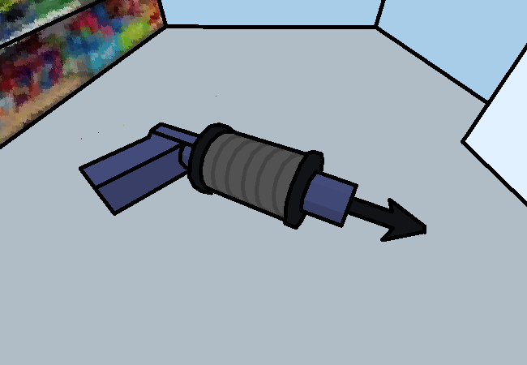

<h1>Captchalog into Sylladex</h1>

Oh hey look, Page 123

Wait what? No, I'm not... Apparently you do that? But only for this page and only as a reference. Okay? You can have your fun for now.

In reality you're still just holding it but pretending those video game mechanics work in real life.

<!--<a href="?p=0124"><h2>> </h2></a>-->

	<a href="?p=0122">Previous Page</a>
	<h5>20/05</h5>

