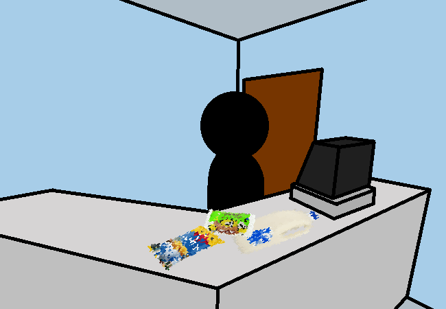

<h1>Gotta go pay and get outta here</h1>

You buy the items and are ready to leave. Now get those pngs upright and get the hell outta here!

<a href="?p=0125"><h2>> Do that</h2></a>

	<a href="?p=0123">Previous Page</a>
	<h5>10/05</h5>

