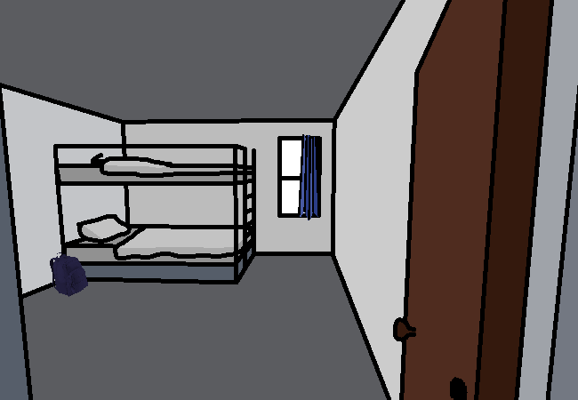

<h1>Get freshened produce up and stash the hand-held grappling device</h1>

You certainly enjoy the multi step commands, huh? I mean I'm not complaining, this is efficient and allows pages to come out a bit faster since I don't have to wait for as many responses. So good job, you!! :Thumbs up 'moji:

Speaking of you, you put the device back in your cabin. Placed on the top bunk and lovingly tucked into bed, because it doesn't fit in your bag. You do deposit the snacks in your bag however.

<a href="?p=0127"><h2>> ==></h2></a>

	<a href="?p=0125">Previous Page</a>
	<h5>11/05</h5>

