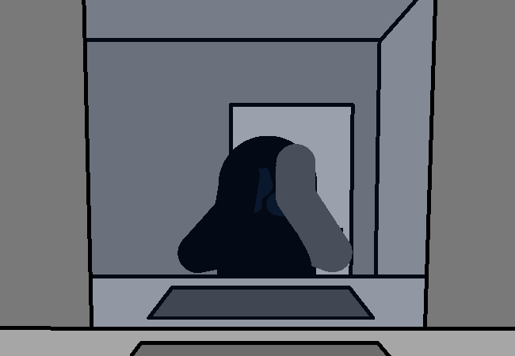

<h1>==></h1>

Okay... Fresh time, only like half fresh though. Just washing your face and taking off your hoodie for now. Showers come later when you're ready for bed, which isn't now.

...

<a href="?p=0128"><h2>> ==></h2></a>

	<a href="?p=0126">Previous Page</a>
	<h5>11/05</h5>

