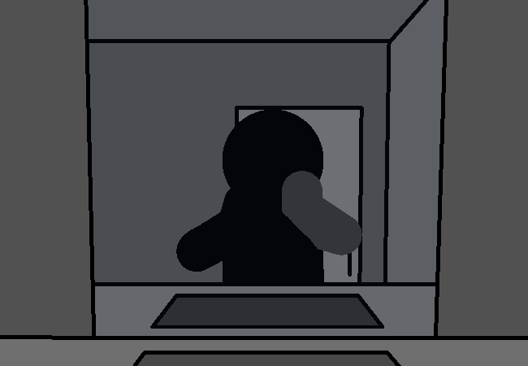

<h1>==></h1>

...

You never enjoyed looking at your reflection, for some reason. It's not like you just think you're ugly or anything, well you're nowhere close to pretty either. It's nothing like that though, and not in any central plot relevant way either... it's just...

<a href="?p=0129"><h2>> ==></h2></a>

	<a href="?p=0127">Previous Page</a>
	<h5>11/05</h5>

