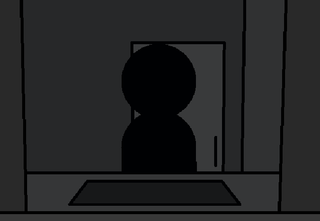

<h1>==></h1>

Something about it...

Something no one else sees...

As far as they're concerned you just look like everyone else...

But to you...

<a href="?p=0130"><h2>> ==></h2></a>

	<a href="?p=0128">Previous Page</a>
	<h5>11/05</h5>

