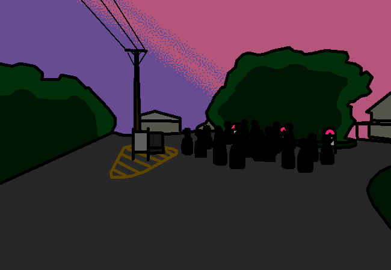

<h1>==></h1>

Again, that actually isn't plot relevant, it's more to do with the character than the story, albeit the characterisation is rather on the nose in that scene though but whatever. This isn't a story about mirror magics though. I mean cool mirror story seems interesting but that's not what's going on in this story. I just don't want to give you the wrong idea and then let you down when it's found out to not be the case.

Okay, back here. You didn't see your parents at the cabin so they may still be in the kitchen area?

It might be nice to help if they're still packing things up somehow.

<a href="?p=0132"><h2>> Look for parents</h2></a>

	<a href="?p=0130">Previous Page</a>
	<h5>11/05</h5>

