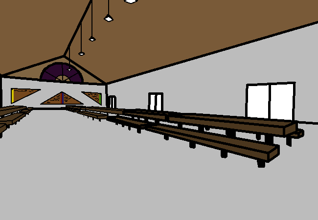

<h1>Look for parents</h1>

As theorised, you find your parents in the kitchen, but they want you to stay in the dining hall area for a moment longer while they finish preparing something.

<a href="?p=0133"><h2>> ==></h2></a>

	<a href="?p=0131">Previous Page</a>
	<h5>14/05</h5>

