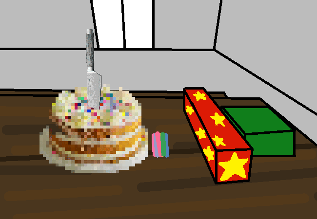

<h1>Slice and dice</h1>

Nova, I need slices!

You, as the master cake cutter, cut the cake and share some out to parentinoes and yourself.

<!--<a href="?p=0136"><h2>> </h2></a>-->

	<a href="?p=0134">Previous Page</a>
	<h5>16/05</h5>

