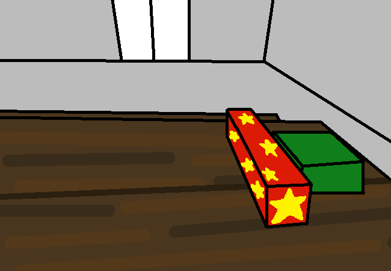

<h1>Eat the sliced and diced cake</h1>

You take a bite. Yummy!!

Well... You're officially 18 now, well you were for a while already but this is like... Like NOW time for being an adult. You never really thought about it that much. It feels like something new, something maybe a bit exciting.  But also something so terrifying, like now you can REALLY mess up. What if you make a wrong move, what if you say the wrong thing, what if the world just feels particularly annoying some day and decides to destroy everything you worked so hard for.  "Worked so hard for"... What if you don't even work hard enough? How will you even know if you've been working hard enough? Maybe you mess up by how much you aren't even trying?? What if...

<a href="?p=0137"><h2>> ==></h2></a>

	<a href="?p=0135">Previous Page</a>
	<h5>16/05</h5>

