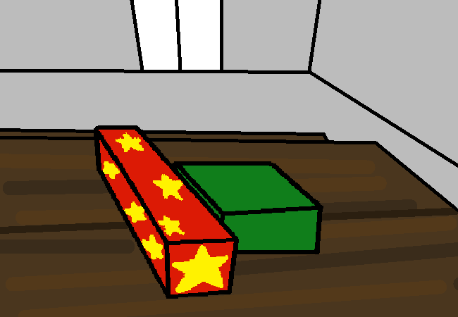

<h1>Eat the sliced and diced cake</h1>

Whatever. Just finish eating the cake, you can worry about all that later.

Anyways, hey look! More presents!!

<a href="?p=0138"><h2>> Open the smaller present</h2></a>

	<a href="?p=0136">Previous Page</a>
	<h5>16/05</h5>

