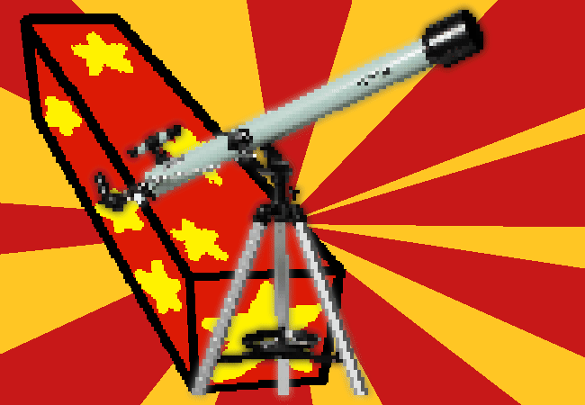

<h1>Open the other totally the same volume but just different dimensioned present</h1>

A- uh. WOW, I stand corrected, or do you stand corrected?? Someone's standing around having just been very corrected right now because they actually went all out with THIS present. It's- wait. It's a telescope, but it's not like you can look at the stars with it or anything... Maybe just long distance viewing in general? Or it's probably meant more as just a really nice thing to have, because they know how much you love space so getting a telescope is probably an ultimate present in some regard?

Either way you also love this one a lot.

You look through it and yes it is an actual telescope currently showing you the ultra zoomed in box it came out of. It also comes with a stand too.

Maybe the telescope is the one standing corrected- no, the telescope is the one standing and correcting us.

<!--<a href="?p=0141"><h2>> </h2></a>-->

	<a href="?p=0139">Previous Page</a>
	<h5>16/05</h5>

