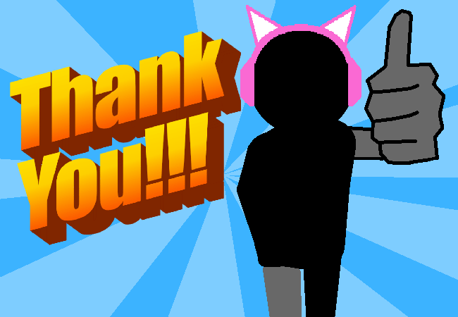

<h1>Double thankies parents</h1>

You ultra hug thank your parents a second time as I once again reuse this image I made like a hundred pages ago now.

Exactly 101 pages... Wow, it's been that long already???

<a href="?p=0142"><h2>> ==></h2></a>

	<a href="?p=0140">Previous Page</a>
	<h5>16/05</h5>

