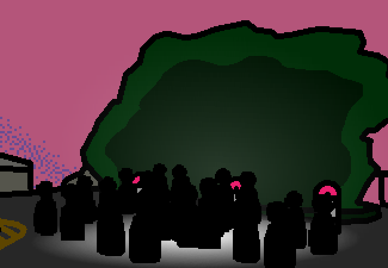

<h1>==></h1>

It seems like... some sort of celebration? Ohhhhh, yeah... There was something that happened a really long time ago? It had something to do with the whole... everything...? The reason why we can't see the stars, the reason why this whole thing was built. The WHOLE thing, everything, the roof, the spires, and whatever the ground itself is resting upon.

Okay well... not that specifically. That celebration is much bigger and in a few months from now. This one seems to be centred more around something else related to it? You've only rarely heard about it, and the only thing you know about it is that it's some... <em>event...</em> that happened a few months before they started construction on this place.

You think you're gonna go to the beach, it's right outside the campsite. Just cause it's sunset and you want to exist in the moment for a bit. Watch the waves go by, feel the breeze, have a moment by yourself. You don't want to miss it by staring at a crowd, you can look it up later.  You'll bring your telescope too, to try it out or something.

<a href="?p=0144"><h2>> First check Weboverse for anything new and add status update</h2></a>

	<a href="?p=0142">Previous Page</a>
	<h5>16/05</h5>

