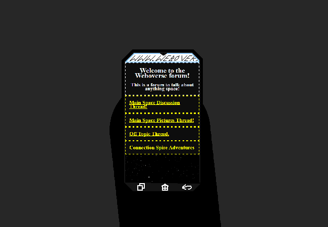

<h1>First check Weboverse for anything new and add status update</h1>

As you're walking back to the cabin, you look around on Weboverse but there's nothing new in any of the threads.

But you do see that there's a new thread called "Connection Spire Adventures".

	
Show new thread

	

		

			<h3>NotTairo - New User</h3>
			
Hey!! Update!!! So, we found this room, it's like a control room of sorts and it has an unlocked router in it so I'm using that to talk on here. Unfortunately however, Mike dropped his phone :( So all the previous recordings are gone, I have some footage and could probably record more but still :(

			
13/03 - 6:05 pm

		

		

			<h3>NotTairo - New User</h3>
			
Dropped as in dropped off the edge of a really high platform and it's gone.

			
13/03 - 6:06 pm

		

		

			<h3>NotTairo - New User</h3>
			
We weren't planning on staying too long so we'll probably head back soon. I don't want to also lose my phone as well.

			
13/03 - 6:06 pm

		

	

<a href="?p=0145"><h2>> ==></h2></a>

	<a href="?p=0143">Previous Page</a>
	<h5>17/05</h5>

