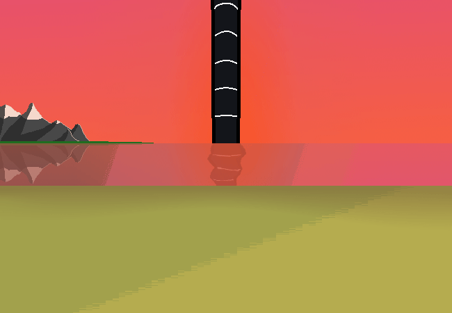

<h1>==></h1>

Okay you're at the beach now. You find a nice spot to sit down and relax.

It's a really pink sunset, it looks quite beautiful, even if a little intense.

<a href="?p=0146"><h2>> [S] ==></h2></a>

	<a href="?p=0144">Previous Page</a>
	<h5>17/05</h5>

