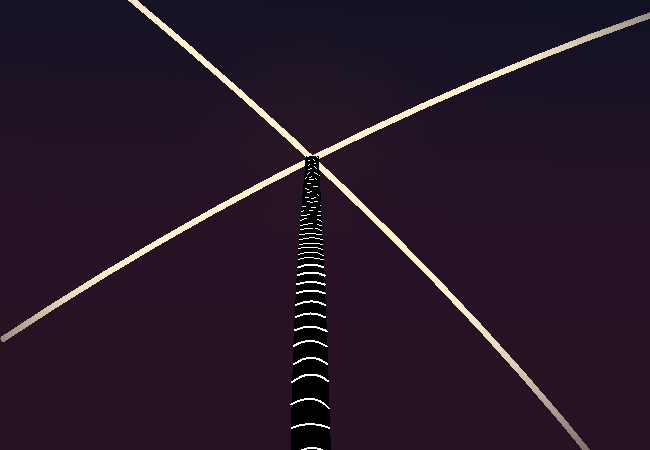

<h1>Become sentimental because why not, we gaze into the sky</h1>

"only to remember we can gase at the sky with magnification phone and teleclopte=i" [sic] (sick) (totally radical dude)

You become sentimental and gaze into the sky, the former action not really having much weight right now but it has still been acted out regardless. The sky is clear with no clouds in sight, you can see the top of the connection spire.

<a href="?p=0148"><h2>> Zoom in with telescope</h2></a>

	<a href="?p=0146">Previous Page</a>
	<h5>20/05</h5>

