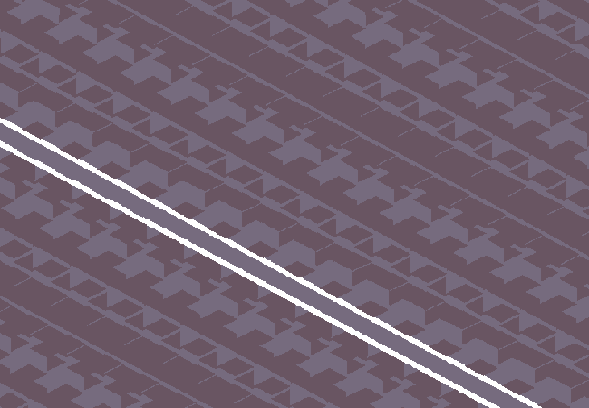

<h1>Zoom in with telescope</h1>

You lower your view slightly so it's less straight up and more toward the pink-ish-orange horizon. Then you look through the telescope, which conveniently zooms in at a desirable viewing distance with perfect focus. Although it looks weird anyways because isometric + strange lighting and colours. It's very optical illusion-y, but rest assured that is the sky.

You can see the tiled screens which don't actually display much, the atmosphere still does most of the sky colourwork, the screens also seem to be more... three dimensional than most screens. It's a strange pattern of jutting out blocks that seem to glow slightly. You're not quite sure of the purpose but it looks cool and technical and stuff.

You can also see the tracks lined along the seams between each connecting sky... tile... running along the grid to the top of the not-spire cylindrical thing with innacurate naming, although you can't see the tower in this image.

You wonder if you could get some exposition on the technicalities behind these structures, perhaps through some <em style="color: yellow;">Universe</em> on the <em style="color: yellow;">Web</em>? (Okay maybe not the sky tile screens, but the other ones mentioned are fine.)

<!--<a href="?p=0149"><h2>> </h2></a>-->

	<a href="?p=0147">Previous Page</a>
	<h5>20/05</h5>

