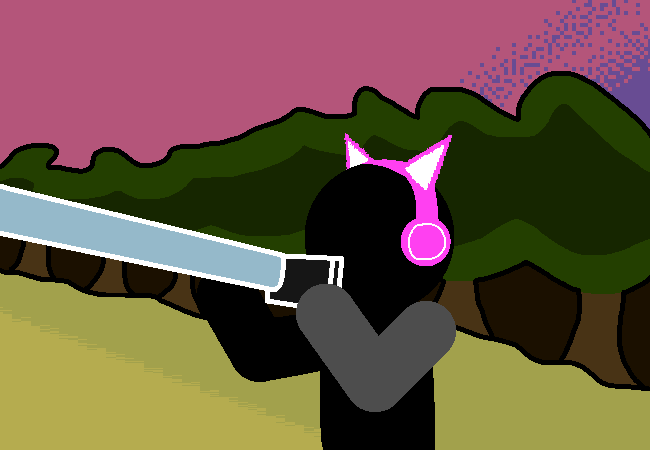

<h1>Take a picture of what is being seen on telescope</h1>

You awkwardly hold your phone's camera up to the telescope lens and take a photo.

<a href="?p=0150"><h2>> Post on pictures thread</h2></a>

	<a href="?p=0148">Previous Page</a>
	<h5>22/05</h5>

