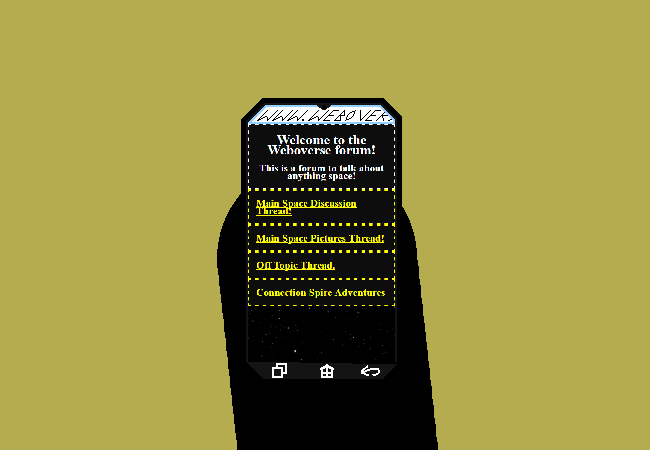

<h1>Post on pictures thread</h1>

You upload the image to the pictures thread on Weboverse. Also remembering the messages from earlier and deciding to colour your own messages.

	
Show new messages

	

		

			<h3>Amethyst - New User</h3>
			
-~Hey!!! I got a telescope ^w^ Can't really see the stars though for obvious reasons, but I got this cool picture of the sky! :3 It's not just a flat screen but more jagged? I never knew that??~-

			
			
13/03 - 6:26 pm

		

		

			<h3>Amethyst - New User</h3>
			
-~It's a bit warped because I had to hold the camera up to the telescope lens but it still looks interesting!!~-

			
13/03 - 6:26 pm

		

	

Also this webcomic is NOT over in like 50 pages times 3 now.

<!--<a href="?p=0151"><h2>> </h2></a>-->

	<a href="?p=0149">Previous Page</a>
	<h5>22/05</h5>

