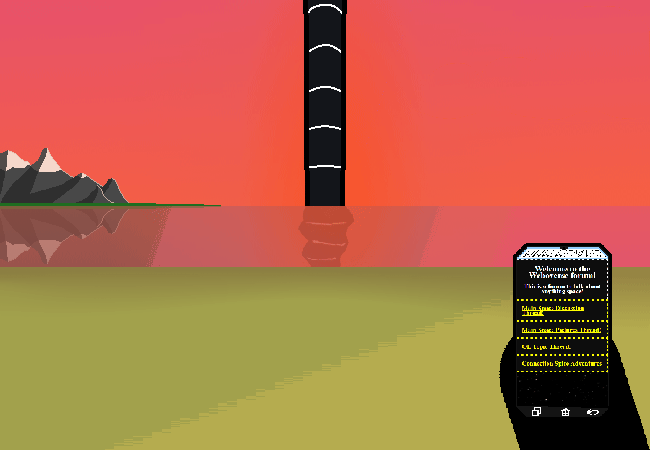

<h1>Web 'em up</h1>

You re-open Weboverse

	
Show new messages

	

		

			<h3>Winter5234 - New User</h3>
			
Oh WOW!!! Most of the pictures I've seen online were during the day or the middle of the night, so you couldn't really make out the details that well. But THIS is a view I haven't seen before :D

			
13/03 - 6:27 pm

		

		

			<h3>Winter5234 - New User</h3>
			
I actually can't really find much info about the sky..... It's all just "BIG SCREENS" and talking about the tracks on them. It seems like SUCH COOL TECH and they just DONT AKNOWLEDGE IT!!!???

			
13/03 - 6:27 pm

		

		

			<h3>Winter5234 - New User</h3>
			
AT LEAST some of the other technologies ARE documented....

			
13/03 - 6:28 pm

		

		

			<h3>Winter5234 - New User</h3>
			
Oh!!!! :O Are we doing the coloured messages thing???

			
13/03 - 6:28 pm

		

		

			<h3>Winter5234 - New User</h3>
			
Actually no, maybe not red????

			
13/03 - 6:28 pm

		

		

			<h3>Winter5234 - New User</h3>
			
Or yellow...... :P

			
13/03 - 6:28 pm

		

		

			<h3>Winter5234 - New User</h3>
			
OR GREEN :(

			
13/03 - 6:28 pm

		

		

			<h3>Winter5234 - New User</h3>
			
OKAY!!!!! I think this one's good!!? Like a bluer green...

			
13/03 - 6:29 pm

		

		

			<h3>Amethyst - New User</h3>
			
-~Hey!! I was actually wondering a bit about those structures, like the spire things or whatever :3~-

			
13/03 - 6:30 pm

		

		

			<h3>Amethyst - New User</h3>
			
-~All I really know is that they're like, power things?? And that's kinda it...~-

			
13/03 - 6:30 pm

		

	

<a href="?p=0154"><h2>> ==></h2></a>

	<a href="?p=0152">Previous Page</a>
	<h5>28/05</h5>

