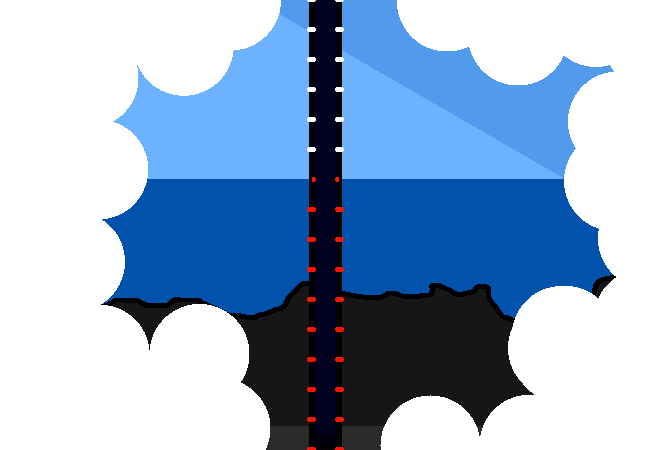

<h1>==></h1>

	
Show new messages

	

		

			<h3>Winter5234 - New User</h3>
			
Their main purpose IS power though, with 3 parts, sort of. Part 1 is power GENERATION, they have these MASSIVE generators inside that are REALLY far underground. They are pretty much the MAIN power source for the WHOLE PLANET!!!!

			
13/03 - 6:31 pm

		

		

			<h3>Winter5234 - New User</h3>
			
It's actually WIND POWERR!!!!!! believe it or not.

			
13/03 - 6:32 pm

		

	

<a href="?p=0156"><h2>> ==></h2></a>

	<a href="?p=0154">Previous Page</a>
	<h5>28/05</h5>

