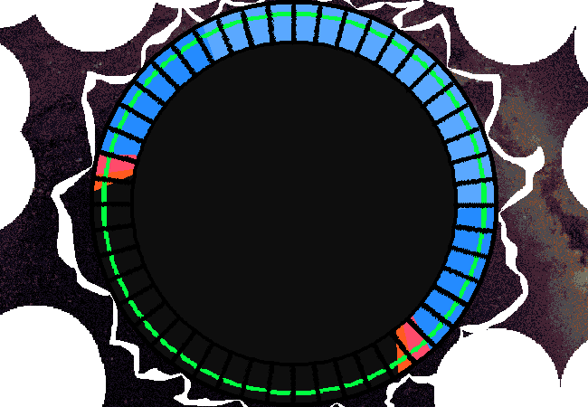

<h1>==></h1>

	
Show new messages

	

		

			<h3>Winter5234 - New User</h3>
			
Part 2 is the main CONNECTION part of the name. They transfer the generated energy across the planet, powering the sky and making sure every area has an even power distribution.

			
13/03 - 6:32 pm

		

		

			<h3>Winter5234 - New User</h3>
			
Honestly I think it's SO COOL how they managed to wire everything up and make it so stable??? I don't even know how I would BEGIN to plan something this MASSIVE??? Most of the things I make are just small little gadgets and stuff. Even my bigger projects are still just... eh :P

			
13/03 - 6:33 pm

		

		

			<h3>Winter5234 - New User</h3>
			
I could probably show you some of them in the future?????

			
13/03 - 6:34 pm

		

		

			<h3>Winter5234 - New User</h3>
			
Okay wait, I just realised part 2 and part 3 are kind of the same thing, I probably could've combined them but........

			
13/03 - 6:34 pm

		

	

<a href="?p=0157"><h2>> ==></h2></a>

	<a href="?p=0155">Previous Page</a>
	<h5>28/05</h5>

