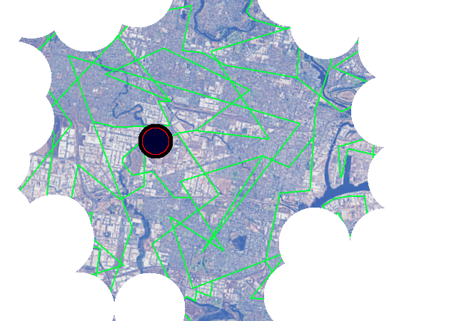

<h1>==></h1>

	
Show new messages

	

		

			<h3>Winter5234 - New User</h3>
			
Part 3 is supplying power to places like cities, for instance.. It's pretty much an UNLIMITED amount of power, even MORE when combined with all the other methods of power generation OUTSIDE of the spires. So it's PRETTY USEFUL for anyone who needs energy!!

			
13/03 - 6:35 pm

		

		

			<h3>Winter5234 - New User</h3>
			
That's the main power bit, uh...

			
13/03 - 6:35 pm

		

	

<a href="?p=0158"><h2>> ==></h2></a>

	<a href="?p=0156">Previous Page</a>
	<h5>28/05</h5>

