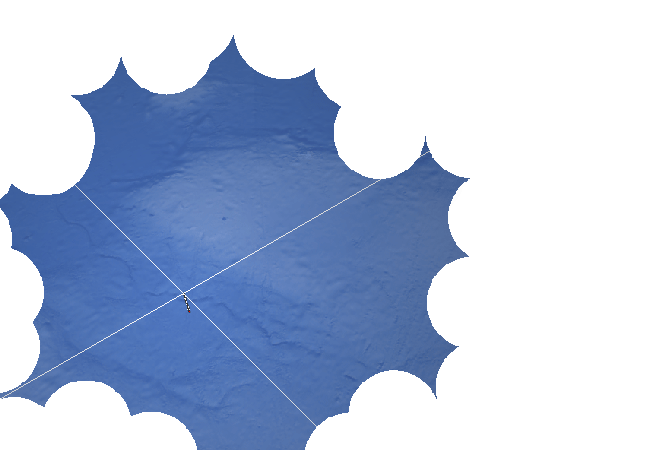

<h1>==></h1>

	
Show new messages

	

		

			<h3>Winter5234 - New User</h3>
			
Yeah, some may say they're structural supports but they're actually COMPLETELY WRONG THERE!!! First off: They're mostly hollow, and most of the wires are embedded within its walls instead of hanging about on the inside. And SECOND!! They are TINY compared to the size of the planet, they're only 500 METERS in radius, which is NOT big enough to support the ENTIRE SKY!!!

			
13/03 - 6:37 pm

		

		

			<h3>Winter5234 - New User</h3>
			
Ah, okay they KIND OF support the sky...? But it's more like the sky is lightly resting on them, most of the support is IN the sky rather than the spires. Most of the ground supports are at the planet's poles anyways.

			
13/03 - 6:38 pm

		

		

			<h3>Winter5234 - New User</h3>
			
The sky actually isn't completely solid either!! Well, it's structurally sound, BUT!!!! They all have movement capabilities, each tile can slide around and retract into the surrounding tiles, usually making up for flexes within the metal and other various scenarios where they need to adjust.

			
13/03 - 6:40 pm

		

	

<a href="?p=0159"><h2>> ==></h2></a>

	<a href="?p=0157">Previous Page</a>
	<h5>28/05</h5>

