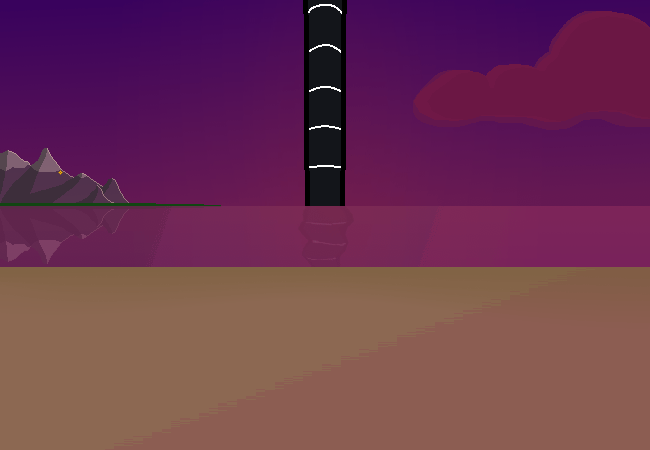

<h1>==></h1>

	
Show new messages

	

		

			<h3>Amethyst - New User</h3>
			
-~Wow!! :3~-

			
13/03 - 6:44 pm

		

		

			<h3>Amethyst - New User</h3>
			
-~That... is a lot!~-

			
13/03 - 6:44 pm

		

		

			<h3>Winter5234 - New User</h3>
			
Ah!! Sorry.. I did not realise how much I wrote :P I was gonna write more too!!

			
13/03 - 6:45 pm

		

		

			<h3>Winter5234 - New User</h3>
			
That's always a thing for me??? I type out a message and it looks really big once I send it, but it never seems that big until then??

			
13/03 - 6:45 pm

		

		

			<h3>Amethyst - New User</h3>
			
-~No no!! It's okay, you're allowed to write words x3 I'm just a bit stunned about how much you know??~-

			
13/03 - 6:46 pm

		

	

<a href="?p=0160"><h2>> ==></h2></a>

	<a href="?p=0158">Previous Page</a>
	<h5>28/05</h5>

