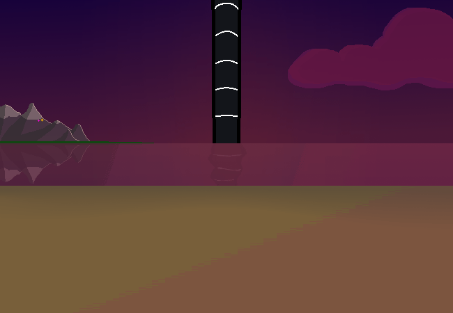

<h1>==></h1>

	
Show new messages

	

		

			<h3>Winter5234 - New User</h3>
			
Hehe, yeah.. I do a LOT of research into these things, I just find them SO COOOL!!!!

			
13/03 - 6:46 pm

		

		

			<h3>Amethyst - New User</h3>
			
-~They are pretty cool :3 I've never really dabbled in technology that much.~-

			
13/03 - 6:47 pm

		

		

			<h3>Amethyst - New User</h3>
			
-~You mentioned your own projects. Do you build things like... idk, robots? I'm just a bit interested in what you've been making.~-

			
13/03 - 6:47 pm

		

		

			<h3>Amethyst - New User</h3>
			
-~It's getting pretty dark so I might leave soon, but I can stay for a bit longer!!~-

			
13/03 - 6:48 pm

		

		

			<h3>Winter5234 - New User</h3>
			
Well recently I've been doing a bit of mini ROCKETRY!! I don't really have the proper materials though so it's mainly being built out of plastic bottles and stuff. It's actually a school project I'm working on!!!

			
13/03 - 6:49 pm

		

		

			<h3>Amethyst - New User</h3>
			
-~That sounds pretty cool!! Have you done any sort of test flight yet? You probably have but just asking.~-

			
13/03 - 6:51 pm

		

		

			<h3>Winter5234 - New User</h3>
			
I've done a test flight with it but it didn't go very far since I didn't want to do a full launch, only a small test one to see if it could get off the ground. It reached around DOUBLE the height of the school building!!!

			
13/03 - 6:52 pm

		

		

			<h3>Amethyst - New User</h3>
			
-~Huh, I wonder how high it'll go when you do a full launch then? Does it have parachutes on it?~-

			
13/03 - 6:53 pm

		

		

			<h3>Winter5234 - New User</h3>
			
YEP!!!! Safely prepared with some good parachutes on it! Wouldn't want it to break or bonk someone on the head on the way down!! XD

			
13/03 - 6:53 pm

		

		

			<h3>Amethyst - New User</h3>
			
-~Yeah x3~-

			
13/03 - 6:54 pm

		

		

			<h3>Winter5234 - New User</h3>
			
It really was nice talking to you!! BUUT I think I should probably go to bed now though...

			
13/03 - 6:54 pm

		

		

			<h3>Amethyst - New User</h3>
			
-~Yeah it is quite late, it was nice to chat with you ^w^ Goodnight!!~-

			
13/03 - 6:55 pm

		

	

<a href="?p=0161"><h2>> [S] ==></h2></a>

	<a href="?p=0159">Previous Page</a>
	<h5>28/05</h5>

