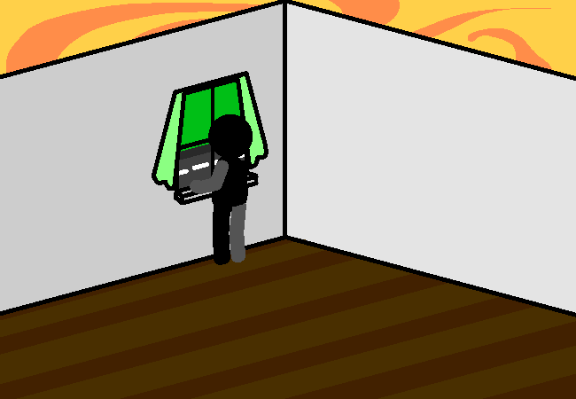

<h1>Investigate?</h1>

You investigate the empty room. It looks empty. There isn't anything in here?

Maybe there's something outside?

<!--<a href="?p=0170"><h2>> </h2></a>-->

	<a href="?p=0168">Previous Page</a>
	<h5>20/06</h5>

