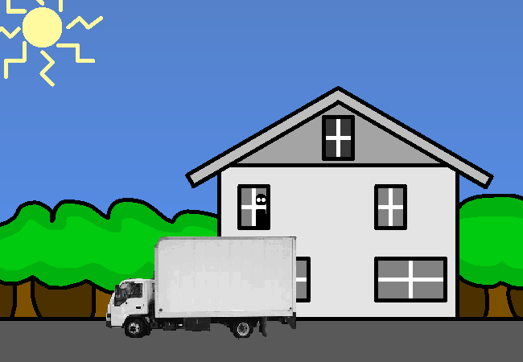

<h1>Take a peek</h1>

You take a peek outside...

Ohh, there's a moving truck, you've probably just bought this house? Either that or just sold it.

It's a bright and sunny day although it's still pretty early in the morning. The sun is shining and- wait why can you see the sun??? I guess we aren't where I thought we were. There seems to be no shell ceiling at all, and you can't see any connection spires in the distance either...

<a href="?p=0171"><h2>> Explore rest of house</h2></a>

	<a href="?p=0169">Previous Page</a>
	<h5>04/07</h5>

