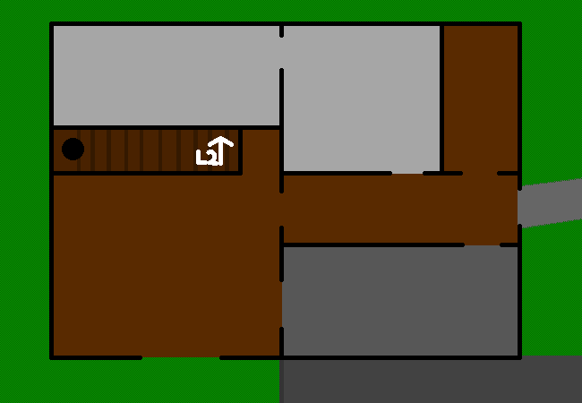

<h1>Explore rest of house</h1>

You wander around the building, every room is like a blank slate either recently cleaned or soon to be messified. Messed up or with, as well as either in the past or future tense. Although the past tense only counts if this is a house that has been lived in before. Again bringing us back to the question of whether you were the previous inhabitant who brought this place to its current cleanliness or the one ready to take it out of such a state.

<!--<a href="?p=0172"><h2>> </h2></a>-->

	<a href="?p=0170">Previous Page</a>
	<h5>08/07</h5>

