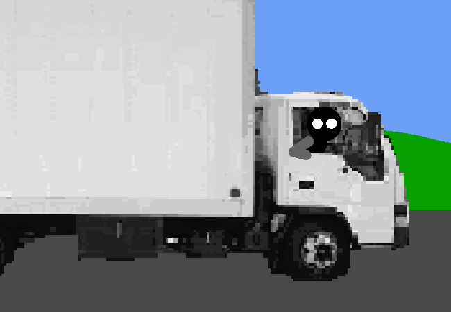

<h1>Say hello to the truck</h1>

You greet the truck and the person inside it is a little confused.

	
Show new messages

	

	

			<h3>Truck Driver</h3>
			
...

			
13/03 - 7:30 am

		

		

			<h3>Truck Driver</h3>
			
Uhhh, your stuff's in the back, y'know? If ur done exploring the house you can start unpacking.

			
13/03 - 7:30 am

		

		

			<h3>Truck Driver</h3>
			
Me? No I'm just the driver, I have no idea where my colleague went but he's the one that helps with like, tables and stuff. I'm not strong enough for any of that, I'm just the one with the trucking license.

			
13/03 - 7:30 am

		

		

			<h3>Truck Driver</h3>
			
You can probably unpack the smaller stuff though and just leave the furniture until later.

			
13/03 - 7:30 am

		

	

Okay, that's confirmation of your quantum state of being.

The second you're observed by another person, all the possibilities collapse into the one truth. That truth being that you are just moving in.

<!--<a href="?p=0173"><h2>> </h2></a>-->

	<a href="?p=0171">Previous Page</a>
	<h5>08/07</h5>

