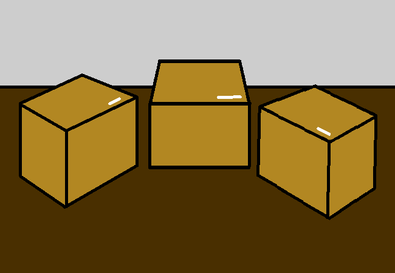

<h1>Locate the important boxes, haul out the smaller ones</h1>

You find a few boxes that you want to unpack first and take them out.

The left one seems to have all your pc stuff in it, the middle one probably has some posters and a calendar, and the right one holds some job related things? Idk I'm just reading the labels. Pick whichever you want, you'll probably get a chance to unpack all of them anyways.

<a href="?p=0175"><h2>> Unpack centre box</h2></a>

	<a href="?p=0173">Previous Page</a>
	<h5>08/07</h5>

