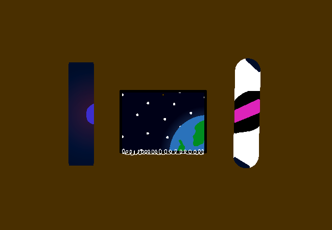

<h1>Unpack centre box</h1>

You unpack the middling centre box and take out the calendar and posters. You can place any of these wherever you want in the room, there isn't much to go off of in the room aide from the window though but direct as you will.

<!--<a href="?p=0176"><h2>> </h2></a>-->

	<a href="?p=0174">Previous Page</a>
	<h5>08/07</h5>

