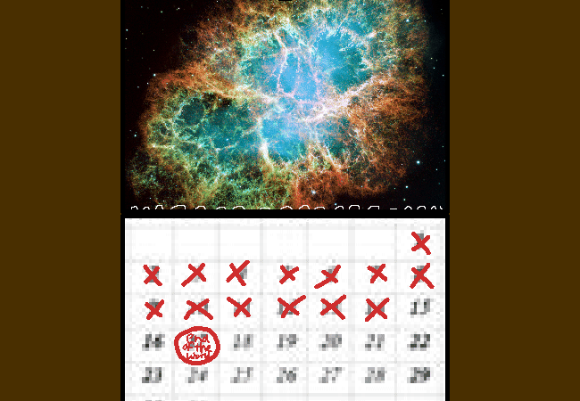

<h1>Inspect calendar</h1>

You inspect the calendar, its front cover is an image of the Earth. You flick through the first two months too fast for me to get a good read (although I don't think they had anything important) and you land on March which has a picture of some nebula. It seems like it's the 14th today. The date in 3 days from now is marked as "End of the world"????? Okay? You don't seem to be reacting to it with sadness or anything so I think it may just be some strange inside joke I don't get?

Uhhh, where do you wanna hang it?

<!--<a href="?p=0177"><h2>> </h2></a>-->

	<a href="?p=0175">Previous Page</a>
	<h5>08/07</h5>

