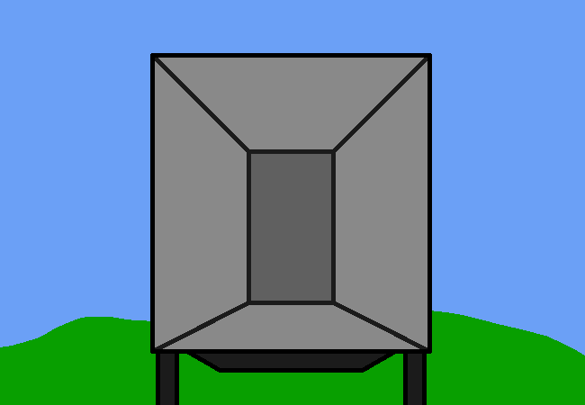

<h1>Go check outside for the truck progress</h1>

You go back down to the truck. All the boxes and furniture were placed in your driveway, presumably while you were busy dropping calendars on the floor upstairs. Although the rest of the items aren't too important and could probably just be unpacked later?

Maybe you could check your computer? Idk, maybe some moving company email or whatever.

<!--<a href="?p=0187"><h2>> </h2></a>-->

	<a href="?p=0185">Previous Page</a>
	<h5>13/07</h5>

