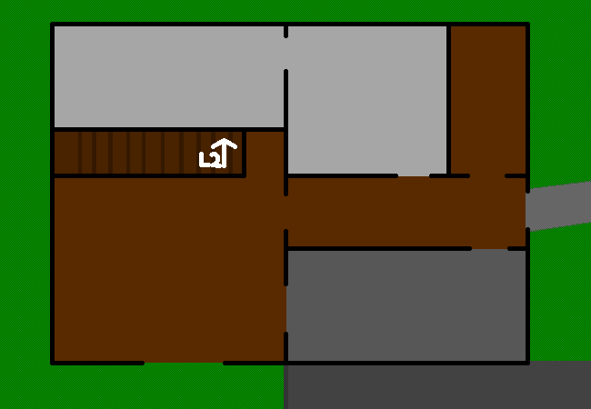

<h1>Last sweep of the house to make sure everything is ready</h1>

One last swe<f>swe</f> of the hou<f>hou</f> to make su<f>s</f> everything is rea<f>rea</f>.

Swa<f>swa</f>

Some jokes just don't work with text I think...

<!--<a href="?p=0188"><h2>> </h2></a>-->

	<a href="?p=0186">Previous Page</a>
	<h5>14/07</h5>

