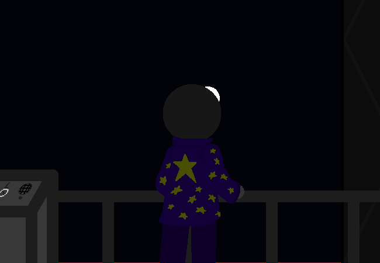

<h1>==></h1>

Or- No, you're the third person in first person...

Wait, does the last guy count? If yes then would this actually be the fourth person?

All of this is ignoring the writing, which is in second person.

 What were we doing?

<a href="?p=0196"><h2>> ==></h2></a>

	<a href="?p=0194">Previous Page</a>
	<h5>23/08</h5>

