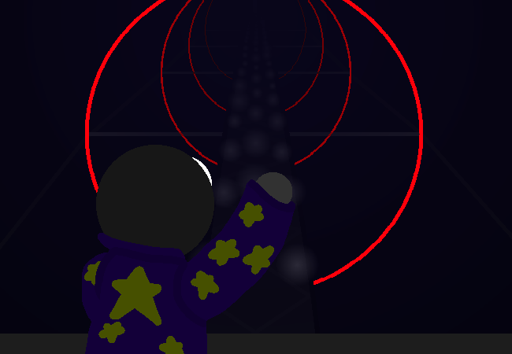

<h1>==></h1>

	
Show new messages

	

		

			<h3>Mei</h3>
			
Why is it hollow? Aren't these structures meant to be support beams?

			
14/03 - 6:21 am

		

		

			<h3>Mike</h3>
			
I have no clue... Maybe the supports are elsewhere, like in the walls??? Either way, I'm certainly not passing up the opportunity to record this!

			
14/03 - 6:21 am

		

		

			<h3>Mike</h3>
			
I actually kind of want to be a photographer at some point, at least for fun. Not enough money for an actual camera though, but I still do some stuff with my phone!

			
14/03 - 6:22 am

		

		

			<h3>Mei</h3>
			
Huh, cool!! I'm thinking I <em>might</em> record some things here and there but I don't have much storage space left, so...

			
14/03 - 6:22 am

		

	

<a href="?p=0197"><h2>> ==></h2></a>

	<a href="?p=0195">Previous Page</a>
	<h5>23/08</h5>

