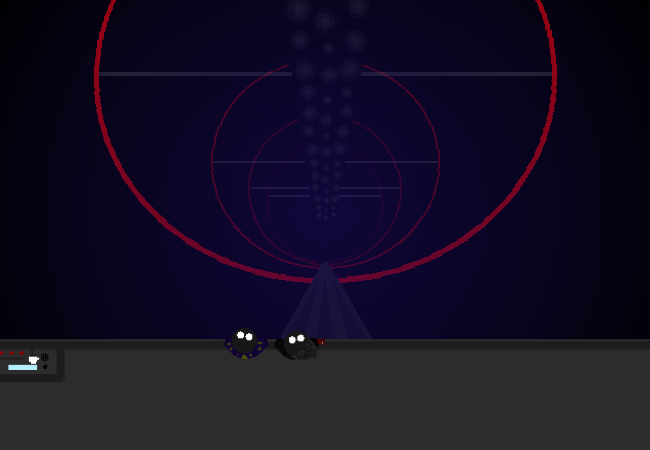

<h1>==></h1>

	
Show new messages

	

		

			<h3>Mei</h3>
			
I actually have no idea what's at the bottom of these things. There isn't much info about them from what I gather, and I haven't exactly gone looking for what <em>has</em> been documented either.

			
14/03 - 6:23 am

		

		

			<h3>Mike</h3>
			
Yeah, it's uh...

			
14/03 - 6:23 am

		

		

			<h3>Mike</h3>
			
Well, you'll see shortly!

			
14/03 - 6:23 am

		

	

Not much to do on the ride down... Maybe go look at the funky control panel again if there's nothing better to do.

<a href="?p=0198"><h2>> Look at control panel</h2></a>

	<a href="?p=0196">Previous Page</a>
	<h5>23/08</h5>

