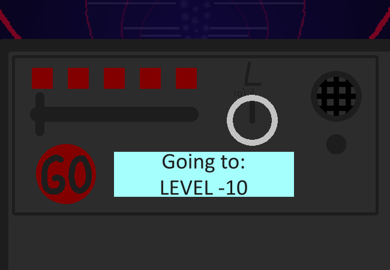

<h1>Look at control panel</h1>

You take a gander at the elevator controls.

On the right is some sort of speaker or microphone? Probably to communicate with... Floors? The front office?

Next to that is a dial with an "L" marked above it. It's turned all the way down to -2, the highest it can go is 10. There's a slider next to that moved all the way to the left with 5 LEDs above it. There's a big red button that says "GO" on it, and a screen to the right of it with the text "Going to: LEVEL -10"

<a href="?p=0199"><h2>> ==></h2></a>

	<a href="?p=0197">Previous Page</a>
	<h5>23/08</h5>

