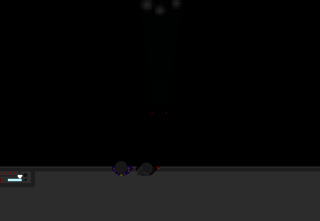

<h1>==></h1>

You arrive at the bottom of the elevator platform, the inner support extends even further down into a dark void and there are some red lights at the end of it. The wind is howling yet it does not feel fresh.

	
Show new messages

	

		

			<h3>Mei</h3>
			
It's... what?

			
14/03 - 6:31 am

		

		

			<h3>Mei</h3>
			
How does it keep going??

			
14/03 - 6:31 am

		

		

			<h3>Mike</h3>
			
Again, no clue...

			
14/03 - 6:32 am

		

	

<a href="?p=0202"><h2>> ==></h2></a>

	<a href="?p=01200">Previous Page</a>
	<h5>30/08</h5>

