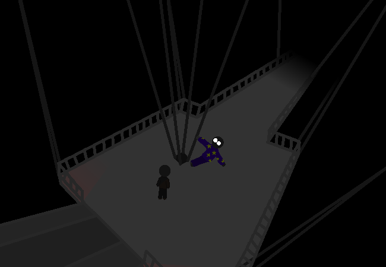

<h1>==></h1>

When the elevator stops, you reach the underhang section. The wind is a whole lot stronger and louder and these platforms feel quite rickety and unsafe, even if the supports feel really strong. What will you do from here?

<!--<a href="?p=0207"><h2>> ==></h2></a>-->

	<a href="?p=0205">Previous Page</a>
	<h5>05/09</h5>

