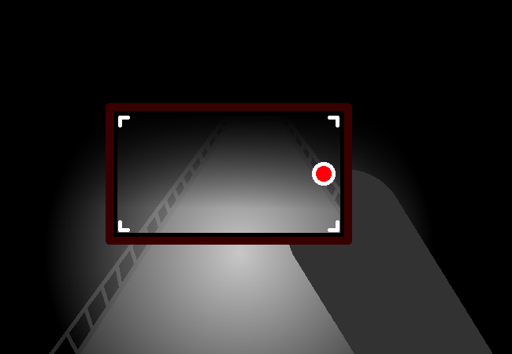

<h1>Pull out phone to light up surroundings</h1>

You take out your phone and continue recording stuff with the light so you can see what's going on a bit better. It's just a really long walking path from what you can see.

	
Show new messages

	

		

			<h3>Mei</h3>
			
What was our... mission statement again?

			
14/03 - 6:41 am
	
		

		

			<h3>Mei</h3>
			
We came here for cool lights that look similar to nebulae, right?

			
14/03 - 6:41 am
	
		

		

			<h3>Mike</h3>
			
Ohhhh yeah, those would be directly below us in fact!

			
14/03 - 6:42 am

		

		

			<h3>Mike</h3>
			
We could try to see if they're there now? I was thinking of walking a bit further so our view wouldn't be as blocked or... light... polluted...? But it doesn't really matter.

			
14/03 - 6:42 am

		

		

			<h3>Kyve</h3>
			
It's been labelled as new messages instead of chat speech or whatever for a while now and I don't feel like fixing it.

			
??/?? - ?:??
	
		

		

			<h3>Mei</h3>
			
Get OUT of the text box!!!!!!!!

			
Never - But actually now - Nothing is nowhere - When? - Never - Like I said - It didn't happen

		

	

<!--<a href="?p=0208"><h2>> ==></h2></a>-->

	<a href="?p=0206">Previous Page</a>
	<h5>09/09</h5>

