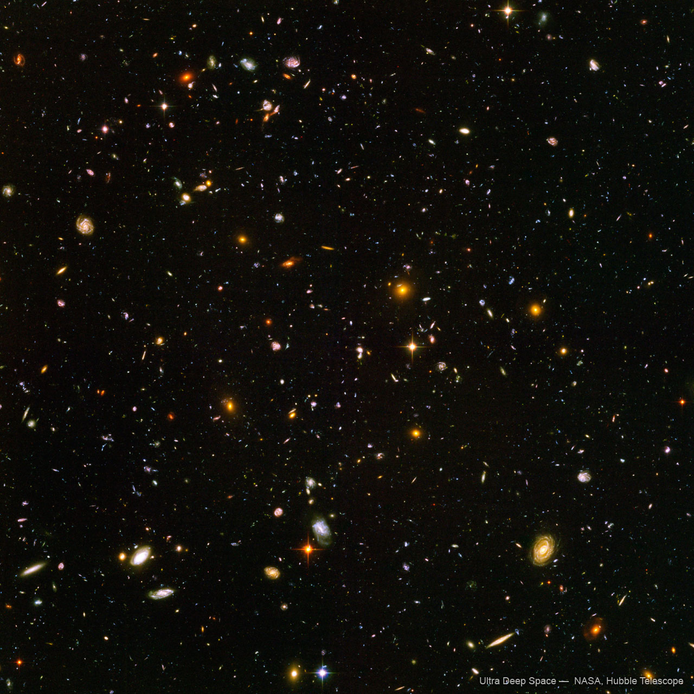
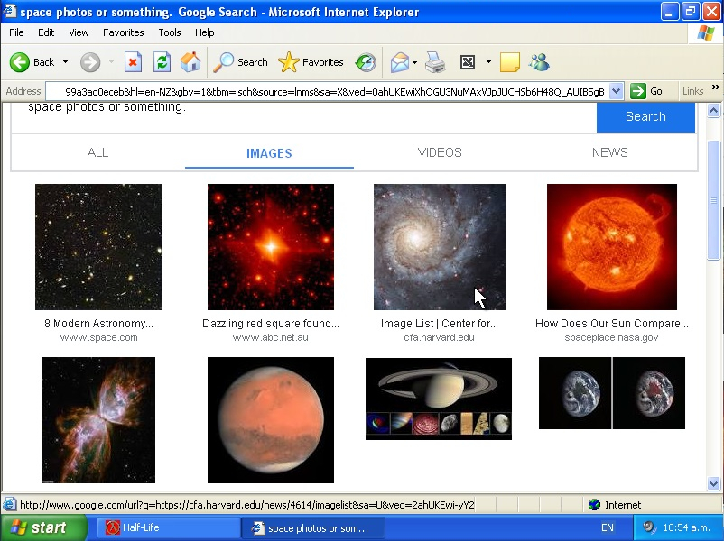

<h1>The WHOLE pictures thread SPOILERS POSSIBLY!!!</h1>

	
Show the ENTIRE pictures thread

	

		

			<h3>MikeL57 - Site Admin</h3>
			
This thread is for sharing space pictures, can be taken by you or found online, it can also be art and drawings of space!

			
07/03 - 10:20 pm

		

		

			<h3>Amethyst - New User (Edited)</h3>
			
-~Hello! I'm new to the forum! I don't have many space pictures but this is one I found online that I like!~-

			
			
11/03 - 7:14 am

		

		

			<h3>Amethyst - New User</h3>
			
-~Wait its too big! Sorry, I don't know how to make it smaller.~-

			
11/03 - 7:15 am

		

		

			<h3>MikeL57 - Site Admin</h3>
			
Oh, uhhh, before sending the message, set a custom size. I forgot to make that automatic...

			
Welcome to the forum though! I'll work on that.

			
11/03 - 3:15 pm

		

		

			<h3>Amethyst - New User</h3>
			
-~Oh, well it's fine. Thank you!! ^w^ ~-

			
11/03 - 7:20 am

		

		

			<h3>xX_SharkMAN_Xx - New User</h3>
			
That space image is cool

			
11/03 - 09:58 am

		

		

			<h3>Amethyst - New User</h3>
			
-~Thanks!!~-

			
11/03 - 8:06 am

		

		

			<h3>xX_SharkMAN_Xx - New User</h3>
			
were do you get space images from?

			
11/03 - 10:43 am

		

		

			<h3>MikeL57 - Site Admin</h3>
			
Shark, you can find them elsewhere on the internet! Go to www.google.com and just search up space photos or something.

			
11/03 - 4:45 pm

		

		

			<h3>xX_SharkMAN_Xx - New User</h3>
			
ok I got some images

			
			
11/03 - 10:57 am

		

		

			<h3>MikeL57 - Site Admin</h3>
			
You can save the images, it doesn't have to be a screenshot of the search engine xD

			
11/03 - 5:01 pm

		

		

			<h3>Winter5234 - New User</h3>
			
<em>WAIT</em> :O That image in the bottom left looks so cool!!! <em>WHAT is it????</em>

			
11/03 - 00:06 am

		

		

			<h3>MikeL57 - Site Admin</h3>
			
I think that's a nebula? I'm not really sure though.

			
11/03 - 5:08 pm

		

		

			<h3>Winter5234 - New User</h3>
			
OH YEAH LOL, I forgot the name of it XD Nebulas are amazing to look at! So colourful and bright!!!

			
11/03 - 00:12 am

		

		

			<h3>MikeL57 - Site Admin</h3>
			
Okay I'm going to log off now, see you guys later!

			
11/03 - 5:12 pm

		

		

			<h3>Winter5234 - New User</h3>
			
Hmmm, MikeL57... How <em>WOULD</em> I take pictures of SPACE like it says in the intro message??? xD

			
11/03 - 00:27 am

		

		

			<h3>MikeL57 - Site Admin</h3>
			
Oh yeah.. There's no clear view to the sky... Maybe you could do the opposite of look up? Below the ground there is the hanging area, mainly used for maintenance, maybe we could go down there and look down at the weird lights that are sometimes below?? I think I heard about that somewhere?

			
It isn't exactly space but it could still be cool to see. Although it is off limits for anyone not working in maintenance.

			
12/03 - 10:51 am

		

		

			<h3>Winter5234 - New User</h3>
			
<em>YOU</em> seem old enough to be allowed down there, but <em>I</em> can't and I don't think the other people on this site can <em>EITHER</em> :(

			
11/03 - 06:58 pm

		

		

			<h3>Winter5234 - New User</h3>
			
<em>WELL I MEAN</em> actually I forgot I'm 19 so I <em>COULD</em>, <em>BUUUUUUUUUTTT</em> I don't really want to... :l

			
11/03 - 06:58 pm

		

		

			<h3>MikeL57 - Site Admin</h3>
			
I guess I could try getting a pic from the maintenance section, might be kinda hard though, considering I don't really have a job there.

			
12/03 - 11:13 am

		

		

			<h3>MikeL57 - Site Admin</h3>
			
Actually... I could probably get one, they don't really seem to care about people going down there. There is basically no security and the actual workers are just sitting at their stations the whole time.

			
12/03 - 11:13 am

		

		

			<h3>MikeL57 - Site Admin</h3>
			
A photo I mean.

			
12/03 - 11:14 am

		

		

			<h3>Winter5234 - New User</h3>
			
WAIT!!!! what do you mean by the lights <em>BELOW????</em> I didn't think there even <em>WAS</em> anything underground?????? :O

			
12/03 - 11:34 am

		

		

			<h3>Winter5234 - New User</h3>
			
ALSO ALSO ALSO, are you <em>SEROUSLY</em> considering commiting a <em>CRIME</em> for just a <em>PICTURE??????</em> :O

			
12/03 - 11:36 am

		

		

			<h3>MikeL57 - Site Admin</h3>
			
(Sorry I just fixed some forum stuff but am back, check in the off-topic thread)

			
Yeah, there is stuff down there. It's where our main source of power is, in fact. The main crazy light show thingy I'll try to capture is rare and only really shows up in specific areas.

			
12/03 - 12:03 am

		

		

			<h3>MikeL57 - Site Admin</h3>
			
It's nothing crazy, again they don't care much. If anyone asks, I'll just say I'm a random journalist or something.

			
12/03 - 12:08 am

		

		

			<h3>MikeL57 - Site Admin</h3>
			
Infact! If anyone else wanted to come, they could! I'm not sure if anyone wants to but if you live in or near this, meet at the #!&amp;%(*%$&amp; city centre, in the park there. I'll be leaving on the 14th, it'll be early though, like 6am, sooooooo.

			
12/03 - 12:10 am

		

		

			<h3>MikeL57 - Site Admin</h3>
			
Wait, this probably shouldn't be in the pictures thread...

			
12/03 - 12:12 am

		

		

			<h3>Winter5234 - New User</h3>
			
HMMMMMM... It could be FUN, BUT I don't live nearby!!! :(

			
12/03 - 12:26 am

		

		

			<h3>MikeL57 - Site Admin</h3>
			
I'll make sure to take lots of videos and photos for you! (and everyone else)

			
12/03 - 12:28 am

		

		

			<h3>MikeL57 - Site Admin</h3>
			
I'll post this in off-topic since it recieves less traffic. If anyone else is coming then reply to the off-topic message since this is still the pictures thread.

			
12/03 - 12:28 am

		

		

			<h3>Amethyst - New User</h3>
			
-~I probably couldn't go... Have fun though!! :3~-

			
12/03 - 12:30 am

		

		

			<h3>Winter5234 - New User</h3>
			
I found this REALLY COOL ONE just now!!!! :D LOOK!!!

			
			
12/03 - 5:53 pm

		

		

			<h3>MikeL57 - Site Admin</h3>
			
Wow, that is really cool! Also thank you for setting the size correctly because that image is really high quality, that reminds me that I still need to fix that! The site'll be down for a bit though because I don't want to edit things while it's active.

			
13/03 - 8:22 am

		

		

			<h3>xX_SharkMAN_Xx - New User</h3>
			
that

			
13/03 - 3:30 pm

		

		

			<h3>xX_SharkMAN_Xx - New User</h3>
			
's an amazing image, its sat there isn't much images of them... (Sorry i misclicked)

			
13/03 - 3:30 pm

		

		

			<h3>Winter5234 - New User</h3>
			
MAYBE!!! (Hear me out on this...) Someone makes ART of it????????

			
13/03 - 1:03 pm

		

		

			<h3>Winter5234 - New User</h3>
			
I'm NOT very GOOD at it but maybe someone ELSE???? Lemme know!!

			
13/03 - 5:04 pm

		

		

			<h3>Amethyst - New User</h3>
			
-~I have wanted to get into art but never got around to it... Maybe I could try this? It won't be good though.~-

			
13/03 - 6:33 pm

		

		

			<h3>Amethyst - New User</h3>
			
-~Okay I've looked at some tutorials and have created this: (I hope it's not too bad! :3)~-

			
			
-~I have to go on a family trip, so see you people in a couple days!~-

			
13/03 - 7:56 pm

		

		<h3>From Nova's Timezone now -14 HRS</h3>
		

			<h3>Amethyst - New User</h3>
			
-~Hey!!! I got a telescope ^w^ Can't really see the stars though for obvious reasons, but I got this cool picture of the sky! :3 It's not just a flat screen but more jagged? I never knew that??~-

			
			
13/03 - 6:26 pm

		

		

			<h3>Amethyst - New User</h3>
			
-~It's a bit warped because I had to hold the camera up to the telescope lens but it still looks interesting!!~-

			
13/03 - 6:26 pm

		

		

			<h3>Winter5234 - New User</h3>
			
Oh WOW!!! Most of the pictures from online I've seen were during the day or the middle of the night, so you couldn't really make out the details that well. But THIS is a view I haven't seen before :D

			
13/03 - 6:27 pm

		

		

			<h3>Winter5234 - New User</h3>
			
I actually can't really find much info about the sky..... It's all just "BIG SCREENS" and talking about the tracks on them. It seems like SUCH COOL TECH and they just DONT AKNOWLEDGE IT!!!???

			
13/03 - 6:27 pm

		

		

			<h3>Winter5234 - New User</h3>
			
AT LEAST some of the other technologies ARE documented....

			
13/03 - 6:28 pm

		

		

			<h3>Winter5234 - New User</h3>
			
Oh!!!! :O Are we doing the coloured messages thing???

			
13/03 - 6:28 pm

		

		

			<h3>Winter5234 - New User</h3>
			
Actually no, maybe not red????

			
13/03 - 6:28 pm

		

		

			<h3>Winter5234 - New User</h3>
			
Or yellow...... :P

			
13/03 - 6:28 pm

		

		

			<h3>Winter5234 - New User</h3>
			
OR GREEN :(

			
13/03 - 6:28 pm

		

		

			<h3>Winter5234 - New User</h3>
			
OKAY!!!!! I think this one's good!!? Like a bluer green...

			
13/03 - 6:29 pm

		

		

			<h3>Amethyst - New User</h3>
			
-~Hey!! I was actually wondering a bit about those structures, like the spire things or whatever :3~-

			
13/03 - 6:30 pm

		

		

			<h3>Amethyst - New User</h3>
			
-~All I really know is that they're like, power things?? And that's kinda it...~-

			
13/03 - 6:30 pm

		

		

			<h3>Winter5234 - New User</h3>
			
Huh, yeah they ARE power things, but they do other stuff too!

			
13/03 - 6:31 pm

		

		

			<h3>Winter5234 - New User</h3>
			
Their main purpose IS power though, with 3 parts, sort of. Part 1 is power GENERATION, they have these MASSIVE generators inside that are REALLY far underground. They are pretty much the MAIN power source for the WHOLE PLANET!!!!

			
13/03 - 6:31 pm

		

		

			<h3>Winter5234 - New User</h3>
			
It's actually WIND POWERR!!!!!! believe it or not.

			
13/03 - 6:32 pm

		

		

			<h3>Winter5234 - New User</h3>
			
Part 2 is the main CONNECTION part of the name. They transfer the generated energy across the planet, powering the sky and making sure every area has an even power distribution.

			
13/03 - 6:32 pm

		

		

			<h3>Winter5234 - New User</h3>
			
Honestly I think it's SO COOL how they managed to wire everything up and make it so stable??? I don't even know how I would BEGIN to plan something this MASSIVE??? Most of the things I make are just small little gadgets and stuff. Even my bigger projects are still just... eh :P

			
13/03 - 6:33 pm

		

		

			<h3>Winter5234 - New User</h3>
			
I could probably show you some of them in the future?????

			
13/03 - 6:34 pm

		

		

			<h3>Winter5234 - New User</h3>
			
Okay wait, I just realised part 2 and part 3 are kind of the same thing, I probably could've combined them but........

			
13/03 - 6:34 pm

		

		

			<h3>Winter5234 - New User</h3>
			
Part 3 is supplying power to places like cities, for instance.. It's pretty much an UNLIMITED amount of power, even MORE when combined with all the other methods of power generation OUTSIDE of the spires. So it's PRETTY USEFUL for anyone who needs energy!!

			
13/03 - 6:35 pm

		

		

			<h3>Winter5234 - New User</h3>
			
That's the main power bit, uh...

			
13/03 - 6:35 pm

		

		

			<h3>Winter5234 - New User</h3>
			
Yeah, some may say they're structural supports but they're actually COMPLETELY WRONG THERE!!! First off: They're mostly hollow, and most of the wires are embedded within its walls instead of hanging about on the inside. And SECOND!! They are TINY compared to the size of the planet, they're only 500 METERS in radius, which is NOT big enough to support the ENTIRE SKY!!!

			
13/03 - 6:37 pm

		

		

			<h3>Winter5234 - New User</h3>
			
Ah, okay they KIND OF support the sky...? But it's more like the sky is lightly resting on them, most of the support is IN the sky rather than the spires. Most of the ground supports are at the planet's poles anyways.

			
13/03 - 6:38 pm

		

		

			<h3>Winter5234 - New User</h3>
			
The sky actually isn't completely solid either!! Well, it's structurally sound, BUT!!!! They all have movement capabilities, each tile can slide around and retract into the surrounding tiles, usually making up for flexes within the metal and other various scenarios where they need to adjust.

			
13/03 - 6:40 pm

		

		

			<h3>Amethyst - New User</h3>
			
-~Wow!! :3~-

			
13/03 - 6:44 pm

		

		

			<h3>Amethyst - New User</h3>
			
-~That... is a lot!~-

			
13/03 - 6:44 pm

		

		

			<h3>Winter5234 - New User</h3>
			
Ah!! Sorry.. I did not realise how much I wrote :P I was gonna write more too!!

			
13/03 - 6:45 pm

		

		

			<h3>Winter5234 - New User</h3>
			
That's always a thing for me??? I type out a message and it looks really big once I send it, but it never seems that big until then??

			
13/03 - 6:45 pm

		

		

			<h3>Amethyst - New User</h3>
			
-~No no!! It's okay, you're allowed to write words x3 I'm just a bit stunned about how much you know??~-

			
13/03 - 6:46 pm

		

		

			<h3>Winter5234 - New User</h3>
			
Hehe, yeah.. I do a LOT of research into these things, I just find them SO COOOL!!!!

			
13/03 - 6:46 pm

		

		

			<h3>Amethyst - New User</h3>
			
-~They are pretty cool :3 I've never really dabbled in technology that much.~-

			
13/03 - 6:47 pm

		

		

			<h3>Amethyst - New User</h3>
			
-~You mentioned your own projects. Do you build things like... idk, robots? I'm just a bit interested in what you've been making.~-

			
13/03 - 6:47 pm

		

		

			<h3>Amethyst - New User</h3>
			
-~It's getting pretty dark so I might leave soon, but I can stay for a bit longer!!~-

			
13/03 - 6:48 pm

		

		

			<h3>Winter5234 - New User</h3>
			
Well recently I've been doing a bit of mini ROCKETRY!! I don't really have the proper materials though so it's mainly being built out of plastic bottles and stuff. It's actually a school project I'm working on!!!

			
13/03 - 6:49 pm

		

		

			<h3>Amethyst - New User</h3>
			
-~That sounds pretty cool!! Have you done any sort of test flight yet? You probably have but just asking.~-

			
13/03 - 6:51 pm

		

		

			<h3>Winter5234 - New User</h3>
			
I've done a test flight with it but it didn't go very far since I didn't want to do a full launch, only a small test one to see if it could get off the ground. It reached around DOUBLE the height of the school building!!!

			
13/03 - 6:52 pm

		

		

			<h3>Amethyst - New User</h3>
			
-~Huh, I wonder how high it'll go when you do a full launch then? Does it have parachutes on it?~-

			
13/03 - 6:53 pm

		

		

			<h3>Winter5234 - New User</h3>
			
YEP!!!! Safely prepared with some good parachutes on it! Wouldn't want it to break or bonk someone on the head on the way down!! XD

			
13/03 - 6:53 pm

		

		

			<h3>Amethyst - New User</h3>
			
-~Yeah x3~-

			
13/03 - 6:54 pm

		

		

			<h3>Winter5234 - New User</h3>
			
It really was nice talking to you!! BUUT I think I should probably go to bed now though...

			
13/03 - 6:54 pm

		

		

			<h3>Amethyst - New User</h3>
			
-~Yeah it is quite late, it was nice to chat with you ^w^ Goodnight!!~-

			
13/03 - 6:55 pm

		

	

<a href="?p=discussionthread"><h2>> Discussion Thread</h2></a>
<a href="?p=picturesthread"><h2>> Pictures Thread</h2></a>
<a href="?p=offtopicthread"><h2>> Off-Topic Thread</h2></a>\
<a href="?p=csathread"><h2>> Connection Spire Adventures Thread</h2></a>

	<h5>ALL TIME</h5>

